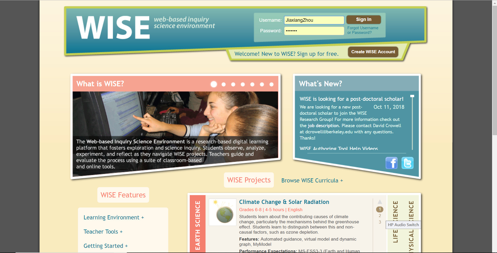
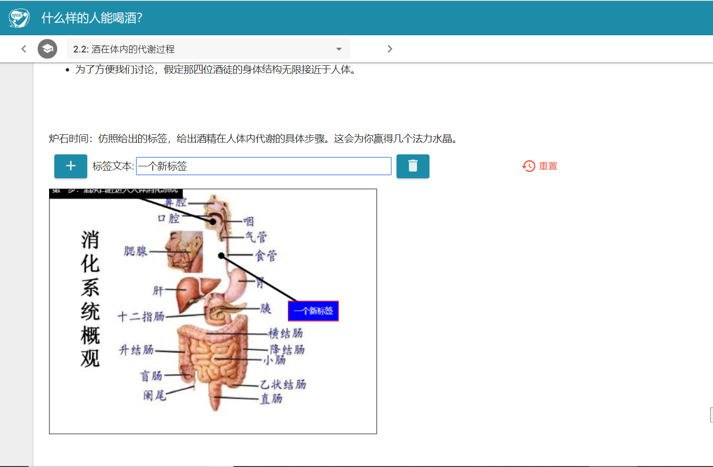

# 
分析典型web教育应用

### 
周嘉翔

### 
教育技术学系 10164507124

    摘 要:	本文简单介绍了考满分网和WISE这两个截然不同的web教育应用，并分析了其中使用的教学理论，同时给出了一些值得改进的建议。

    关键词:	web 教育应用 学习理论

## 一、简介
        本文主要分析的是两个资源学习类web教育应用：考满分网（https://www.kmf.com/，以下简称考满分）和WISE（https://wise.berkeley.edu/）。
        考满分网（https://www.kmf.com/，以下简称考满分）
        

        
        是考满分机构下属的一个产品，是专注于出国考试在线的专业备考网站。网站业务聚焦TOEFL、IELTS、GRE、GMAT、SAT、ACT留学考试在线备考与辅导，旨在通过科学高效的课程体系和严谨周到的教学服务，真实满足百万留学生的提分需求。

        WISE全名为Web-based Inquiry Science Environment，即基于网络的探究科学环境。

        
        WISE项目让学生像真正的科学家一样工作。通过各种 活动和支架工具，让学生相互协作探索对现实中的重要问题。他们提出相关问题并作出预测；用计算模型进行实验；评估并区分不一致的信息；通过思考与讨论来构建基于证据的解释。从WISE的 探究式项目中，学生不仅仅学到了在科学课中赖以成功的技能，同时也学到了成为负责任的，具有批判性思维的公民所应具备的技能。
        同样是教育类web app，但从简介中就可了解这两个web app的目标、方法，以及因此所选用的学习理论等都是截然不同的。在第二部分中将给出更细致的分析。

## 二、分析

        考满分主要使用的是行为主义学习理论。从根本目的来看，考满分的定位是培养学生对与跨国申学考试的应试能力，因而其提供的学习资源也很简单，就是一套套的TPO真题和模拟题。以托福为例，在考满分上，学生可以选择进行整套试卷的练习，那样他们会依次完成托福考试中的听力、阅读、口语、写作四个板块，从而模拟真实的托福考试体验。学生也可以选择单个板块、单个练习，来做针对性的训练。

        
        因此，考满分主要通过提供模拟训练帮助学生进行应试，也就是所谓的“刷题”。这本质上是一种“强化反射”，但和“巴普洛夫的狗”的训练模式又有所不同。在训练中，学生对与考试时间分配的能力、对题型的熟悉程度随着刷题量的提升而增强，把这称为“强化反射”是没有问题的。但同时，学生在刷题中逐渐建立属于自己的解题方法，积累了快速寻找答案的经验并将其化为自己的技能，这又属于认知主义学习理论的范畴。当然，从考满分网的角度看，给予学生的无非是强化训练的素材，这点不会改变。但从学生角度来看，他们在学习过程中会自我解构知识并产生新的技能或领悟，因此是<b>行为主义与认知主义并行</b>的。

        WISE可以称得上是建构主义学习理论教科书式的应用。WISE教师帐户提供了一套集成工具，可帮助教师监控学生的实时进度，促进评分和提供反馈，并自动评估嵌入式评估。

    	通过与实践教师的合作，这些工具不断得到完善，他们了解管理现代教室的真正挑战。通过促进这些必要但耗时的任务，WISE教师可以自由地专注于使其成为必不可少的东西：为个别学生提供高质量的教学。而从学生角度，WISE项目会通过个人和社会相关主题向他们介绍复杂的科学概念。例如学生通过帮助清理墨西哥湾漏油事件来确定洗涤剂分子的结构; 通过调查候选治疗癌症来了解有丝分裂; 通过优化航天飞机脱轨的路径来探索轨道和抛射物的运动。每个项目都使用经过课堂测试的教学模式，重视学生带来的想法，帮助他们将新信息与个人经历联系起来，并将他们的各种想法融入对科学的连贯理解中。同时，个别学生的经历，兴趣和能力各不相同。有些人可能擅长写作，而其他人可能喜欢绘画。有些人可以流利地说多种语言，而可能会将英语作为第二语言或第三语言学习。这就是为什么WISE提供各种工具，活动模式和教学支架，为表达和评估理解提供多种方式。这样，没有学生的能力得不到承认，所有人都有机会获得成功。
## 三、	建议
        对于不同的问题，就有不同的解决方案。我们无法判断考满分和WISE孰优孰劣，因为它们面向了不同群体的需求。但不可否认，它们都在较完美地解决了自己所面对的需求。对此，笔者已经很难从学习理论角度出发给出切实可行的建议。不过，教育理论并非是单选题，对于考满分网来说，可以适当引入一些建构主义理论并应用，由此增强学生的学习而非应试能力。在学习能力提升后，学生不仅仅是此次考试，对于其终生的语言学习都会有帮助。而WISE的少数缺陷在于，建构一个合理的、支架丰富而又有用的情景实在需要深思熟虑，因此一个好的项目会花费相当大的精力。如何扩大其使用，使更多的人能参与其中，贡献出他们的想法是需要考虑的。
##  四、结论
        选用何种支持Web教育应用的学习理论，主要取决于app的需求定位，学习理论本身没有显著的优劣之分。但最好的情况，是混合各种学习理论，从而更好的完成“教育”的目的，即学习的不应只有知识，还有相应的能力。在大型的教育app中，最宜贯彻这种理念。

